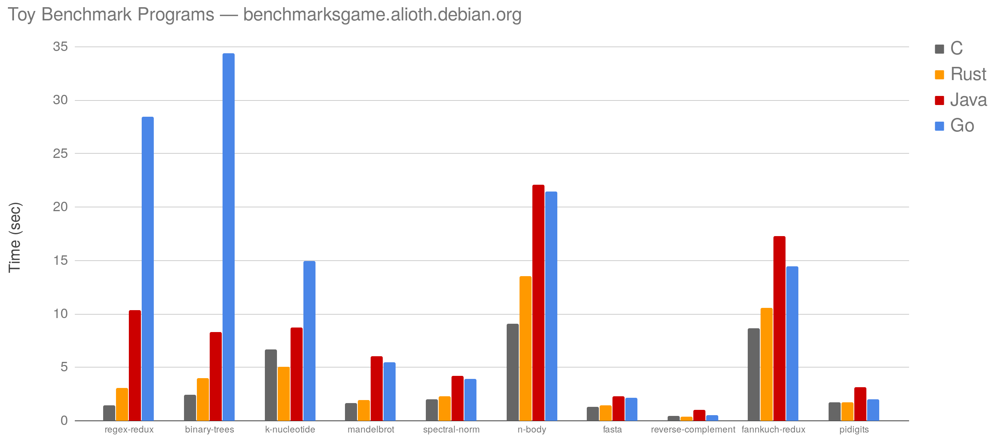

class: center, middle, ferris

Introduction to Rust
====================

Wesley Moore
------------


---

# Agenda

1. Features
2. Tooling
3. Concepts
4. Demo
5. Questions

---

# Introduction

```rust
fn main() {
  println!("Rust Introduction");
}
```

> **Rust** is a systems programming language that runs blazingly fast, prevents
> segfaults, and guarantees thread safety. 

— [rust-lang.org](https://www.rust-lang.org/)

---

# Systems Programming Language

* Compiles to native code.

--

* Aims to solve the same sorts of problems that C and C++ are used to solve but
  with improved safety.

--

* Also seeing use in:

--

  * Web (front and backend)

--

  * Operating systems ([Redox OS][redox])

--

  * Embedded systems (microcontrollers)

---

# Runs Blazingly Fast



---

# Runs Blazingly Fast

* No interpreter, no runtime.

--

* Memory safety without garbage collection.

--

* Zero cost abstractions.

---

class: segfaults

# Prevents Segfaults

* No `nil`, `NULL` or other [billion dollar mistakes][billion-dollar-mistake].


This is not a thing. At all. Ever.

.center[[billion-dollar-mistake]: https://www.infoq.com/presentations/Null-References-The-Billion-Dollar-Mistake-Tony-Hoare]

---

# Guarantees Thread Safety

* Strongly, statically typed with an emphasis on safety and correctness.

--

* Ownership model tracks owner and lifetime of memory.

--

* No data races: Compiler knows which thread owns what data.

--

* This leads to, "[Fearless Concurrency][fearless-concurrency]".

> Mozilla made two previous attempts to parallelize its style system in C++,
> and both of them failed. But Rust’s fearless concurrency has made parallelism
> practical!

— [Fearless Concurrency in Firefox Quantum](https://blog.rust-lang.org/2017/11/14/Fearless-Concurrency-In-Firefox-Quantum.html) (Nov 2017)

---

# Strong Static Type System

* Do more at compile time so fewer tests and runtime checks are required.

--

* Concepts mostly familiar. No need to learn an entirely new paradigm.

--

* Traits and generics instead of objects and inheritance.

--

* Type inference reduces the need to provide type annotations.

--

* Refactor with impunity — even in large code bases.

---

# Tooling

Official distribution includes: `cargo`
--
:

* Build tool (no Makefiles)

--

* Package manager (like bundler)

--

* Test runner

--

* Documentation generator

---

## Releases

Generally managed with `rustup`
--
:

* Official toolchain manager (like rbenv)

--

* New releases every 6 weeks
  * Committed to backwards compatibility in every release.

---

class: crates

# Crates

* Rust favours a small, stable standard library.
* Crates are the equivalent of Ruby gems. They are published to
  [crates.io](https://crates.io/).


---

# Community and Direction

* RFC process.

--

* Systematic improvement.

--

* Emphasis on inclusion and building a friendly community.

---

class: center, middle, bigger

Concepts
========

---

# Functions

```rust
fn add(left: i32, right: i32) -> i32 {
    left + right
}

fn main() {
    let sum = add(2, 3);
}
```

---

# Conditionals: if

```rust
let temperature: i32 = 29;

if temperature > 25 {
    println!("Wesley is happy");
}
else {
    println!("Too cold");
}
```

---

# Conditionals: match

Can match structure and values:

```rust
let month = "jan";

match month {
    "jan" => 1,  "feb" => 2,
    "mar" => 3,  "apr" => 4,
    "may" => 5,  "jun" => 6,
    "jul" => 7,  "aug" => 8,
    "sep" => 9,  "oct" => 10,
    "nov" => 11, "dec" => 12,
    _     => panic!("invalid month"),
};

```


---

# Loops

```rust
let numbers = [1, 2, 3];

for i in numbers.iter() {
    // do something
}

for i in 0..10 {
    // do something
}
```

Also less frequently used commonly used `loop` and `while`.

---

# Functional or Imperative

```rust
fn variance_mean(data: &[f64], mean: f64) -> f64 {
    let mut sum = 0.;

    for d in data {
        sum += (d - mean).powf(2.0);
    }

    sum / data.len() as f64
}
```

Code from [hydromath] crate by Andrew MacDonald.

---

# Functional or Imperative

```rust
fn variance_mean(data: &[f64], mean: f64) -> f64 {
    data.into_iter()
        .map(|d| (d - mean).powf(2.0))
        .sum::<f64>() / data.len() as f64
}
```

--

You pay _no cost_ for using the higher level style, it compiles to identical
machine code (I checked).

---

# enums

Type that represents one possibility of several variants. Variants may optionally
carry data.

```rust
enum SerialProtocol {
    Usb,
    Rs485,
    Rs232,
    I2C,
    Spi,
}
```

---

# structs

Type that carries structured data.

```rust
struct Person {
    name: String,
    age: i32,
    favourite_serial_protocol: SerialProtocol,
}

impl Person {
    fn name_and_age(&self) -> String {
        format!("{} is {} years old", self.name, self.age)
    }
}
```

---

# Option

Instead of `nil` and `NULL` there is `Option`.

* Used to represent something that may be absent.

```rust
enum Option<T> {
    Some(T),
    None
}
```

---

# Result

When something can succeed or fail with an error.

* There are no exceptions in Rust, `Result` is how you handle errors.

```rust
enum Result<T, E> {
    Ok(T),
    Err(E)
}
```

---

Demo
====

Small tool that will determine a file's type from its extension:

```shell
filetype src/main.rs somefile.rb
```

Should give output like:

```
Rust: src/main.rs
Ruby: src/somefile.rb
```

---

class: center, middle, bigger

Demo
====

---

class: center, middle, invert, bigger

<svg class="rust-logo" xmlns="http://www.w3.org/2000/svg" x="0px" y="0px" width="250px" height="250px" viewbox="0 0 144 144"><path d="M67.743 31.035a3.108 3.108 0 0 1 6.216 0a3.108 3.108 0 0 1 -6.216 0M30.666 59.175a3.108 3.108 0 0 1 6.216 0a3.108 3.108 0 0 1 -6.216 0m74.153.145a3.108 3.108 0 0 1 6.216 0a3.108 3.108 0 0 1 -6.216 0M39.663 63.578c1.43-.635 2.076-2.311 1.441-3.744l-1.379-3.118h5.423V81.16H34.207a38.265 38.265 0 0 1 -1.239-14.607zm22.685 0.601v-7.205h12.914c.667 0 4.71.771 4.71 3.794c0 2.51-3.101 3.41-5.651 3.41zM44.717 102.972a3.108 3.108 0 0 1 6.216 0a3.108 3.108 0 0 1 -6.216 0m46.051.145a3.108 3.108 0 0 1 6.216 0a3.108 3.108 0 0 1 -6.216 0m.961-7.048c-1.531-.328-3.037.646-3.365 2.18l-1.56 7.28a38.265 38.265 0 0 1 -31.911-.153l-1.559-7.28c-.328-1.532-1.834-2.508-3.364-2.179l-6.427 1.38a38.265 38.265 0 0 1 -3.323 -3.917h31.272c.354 0 .59-.064.59-.386V81.932c0-.322-.236-.386-.59-.386h-9.146v-7.012h9.892c.903 0 4.828.258 6.083 5.275.393 1.543 1.256 6.562 1.846 8.169.588 1.802 2.982 5.402 5.533 5.402h16.146a38.265 38.265 0 0 1 -3.544 4.102zm17.365-29.207a38.265 38.265 0 0 1 .081 6.643 h-3.926c-.393 0-.551.258-.551.643v1.803c0 4.244-2.393 5.167-4.49 5.402-1.997 .225-4.211-.836-4.484-2.058-1.178-6.626-3.141-8.041-6.241-10.486 3.847-2.443,7.85-6.047 7.85-10.871 0-5.209-3.571-8.49-6.005-10.099-3.415-2.251-7.196-2.702-8.216-2.702H42.509a38.265 38.265 0 0 1 21.408-12.082l4.786 5.021c1.082 1.133 2.874 1.175 4.006.092l5.355-5.122a38.265 38.265 0 0 1 26.196 18.657l-3.666 8.28c-.633 1.433.013 3.109 1.442 3.744zm9.143.134-.125-1.28 3.776-3.522c.768-.716.481-2.157-.501-2.523l-4.827-1.805-.378-1.246 3.011-4.182c.614-.85.05-2.207-.984-2.377l-5.09-.828-.612-1.143 2.139-4.695c.438-.956-.376-2.179-1.428-2.139l-5.166.18-.816-.99 1.187-5.032c.24-1.022-.797-2.06-1.819-1.82l-5.031 1.186-.992-.816.181-5.166c.04-1.046-1.184-1.863-2.138-1.429l-4.694 2.14-1.143-.613-.83-5.091c-.168-1.032-1.526-1.596-2.376-.984l-4.185 3.011-1.244-.377-1.805-4.828c-.366-.984-1.808-1.267-2.522-.503l-3.522 3.779-1.28-.125-2.72-4.395c-.55-.89-2.023-.89-2.571 0l-2.72 4.395-1.281.125-3.523-3.779c-.714-.764-2.156-.481-2.522.503l-1.805 4.828-1.245.377-4.184-3.011c-.85-.614-2.209-.048-2.377.984l-.83 5.091-1.143.613-4.694-2.14c-.954-.436-2.178.383-2.138 1.429l.18 5.166-.992.816-5.031-1.186c-1.022-.238-2.06.798-1.82 1.82l1.185 5.032-.814.99-5.166-.18c-1.042-.03-1.863 1.183-1.429 2.139l2.14 4.695-.613 1.143-5.09.828c-1.034.168-1.594 1.527-.984 2.377l3.011 4.182-.378 1.246-4.828 1.805c-.98.366-1.267 1.807-.501 2.523l3.777 3.522-.125 1.28-4.394 2.72c-.89.55-.89 2.023 0 2.571l4.394 2.72.125 1.28-3.777 3.523c-.766.714-.479 2.154.501 2.522l4.828 1.805.378 1.246-3.011 4.183c-.612.852-.049 2.21.985 2.376l5.089.828.613 1.145-2.14 4.693c-.436.954.387 2.181 1.429 2.139l5.164-.181.816.992-1.185 5.033c-.24 1.02.798 2.056 1.82 1.816l5.031-1.185.992.814-.18 5.167c-.04 1.046 1.184 1.864 2.138 1.428l4.694-2.139 1.143.613.83 5.088c.168 1.036 1.527 1.596 2.377.986l4.182-3.013 1.246.379 1.805 4.826c.366.98 1.808 1.269 2.522.501l3.523-3.777 1.281.128 2.72 4.394c.548.886 2.021.888 2.571 0l2.72-4.394 1.28-.128 3.522 3.777c.714.768 2.156.479 2.522-.501l1.805-4.826 1.246-.379 4.183 3.013c.85.61 2.208.048 2.376-.986l.83-5.088 1.143-.613 4.694 2.139c.954.436 2.176-.38 2.138-1.428l-.18-5.167.991-.814 5.031 1.185c1.022.24 2.059-.796 1.819-1.816l-1.185-5.033.814-.992 5.166.181c1.042.042 1.866-1.185 1.428-2.139l-2.139-4.693.612-1.145 5.09-.828c1.036-.166 1.598-1.524.984-2.376l-3.011-4.183.378-1.246 4.827-1.805c.982-.368 1.269-1.808.501-2.522l-3.776-3.523.125-1.28 4.394-2.72c.89-.548.891-2.021.001-2.571z"/></svg>

Questions?
==========

---

Credits
=======

* [Animated Ferris][animated-ferris] by A. L. Palmer, via [rustacean.net][rustacean].
* Portions of this talk were derived from [A Very Brief Intro to Rust][rust-intro]  
  Copyright © 2016 Ashley Williams.
* Benchmarks chart generated from data on [The Computer Language
  Benchmarks Game][benchmarks] on 10 Jan 2018.

[rust-intro]: https://github.com/rustbridge/a-very-brief-intro-to-rust
[animated-ferris]: https://www.behance.net/gallery/42774743/Rustacean
[rustacean]: http://rustacean.net/
[fearless-concurrency]: https://doc.rust-lang.org/book/second-edition/ch16-00-concurrency.html
[redox]: https://www.redox-os.org/
[hydromath]: https://github.com/amacd31/hydromath_rs
[benchmarks]: https://benchmarksgame.alioth.debian.org/
