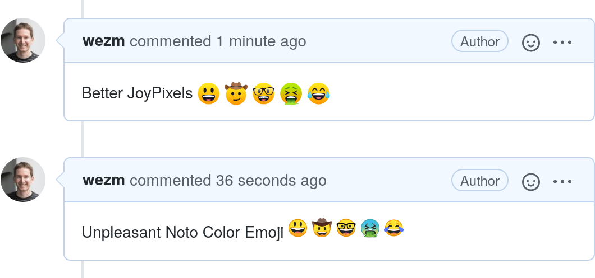

+++
title = "Working Around GitHub Browser Sniffing to Get Better Emoji on Linux"
date = 2020-06-19T18:03:43+10:00

# [extra]
# updated = 2020-06-19T09:30:00+10:00
+++

I have my system configured[^1] to use [JoyPixels] for emoji, which I consider
vastly more attractive than Noto Color Emoji. Sadly GitHub uses browser
sniffing to detect Linux user-agents and replaces emoji with (badly aligned)
images of Noto Color Emoji. They don't do this on macOS and Windows. In this
post I explain how I worked around this.

<!-- more -->

  

The solution is simple: make GitHub think you're using a Mac or Windows PC.
There are various ways to change the User-Agent string of Firefox. The easiest
is via `about:config` but I didn't want it to be a global change — I
want sites to know that I'm using Linux in logs/privacy respecting analytics (I
block most trackers).

I ended up using the [User-Agent Switcher and Manager] browser add-on. I
configured its allow list to only include `github.com`, and use the
`User-Agent` string for Firefox on macOS. The end result? JoyPixels, just like
I wanted.

**P.S.** If anyone from GitHub sees this. Please stop browser sniffing Linux
visitors.  Linux desktops and browsers have had working emoji support for years
now.

[^1]: I use the term, "configured", loosely here as all I really did was install the
[ttf-joypixels](https://www.archlinux.org/packages/community/any/ttf-joypixels/) package.

[JoyPixels]: https://www.joypixels.com/
[User-Agent Switcher and Manager]: https://addons.mozilla.org/en-US/firefox/addon/user-agent-string-switcher/
