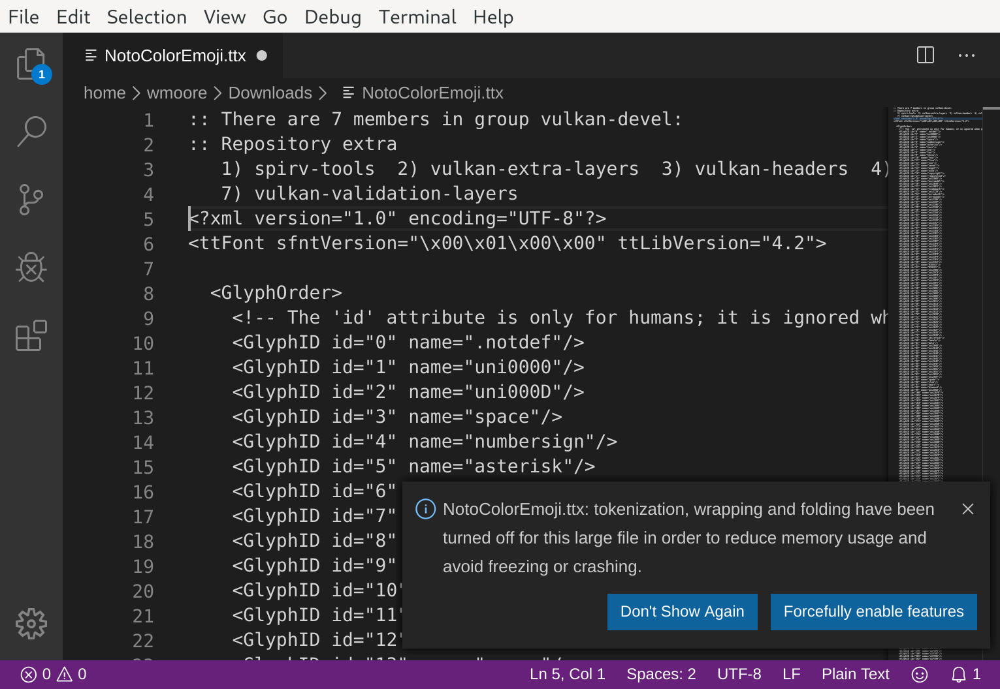

+++
title = "Neovim Versus the 28Mb XML File"
date = 2020-01-26T10:47:41+10:00
draft = true

# [extra]
# updated = 2019-07-01T22:40:53+10:00
+++

I had occasion recently to open and navigate a 28Mb XML file. This proved a
challenge for Neovim's syntax highlighting, which prompted me to see how some
other editors handled the file. In this post I want to expand on the problem a
bit more and explore ways in which the task can be handled without the need to
switch to another editor.

<!-- more -->

It all started withe the following [tweet](https://twitter.com/wezm/status/1219759981441871875?s=20):

> Battle of the editors! It's 2020, on a 12c/24t Ryzen 9 system with 16Gb of RAM, which Linux text editor can open, syntax highlight, and provide folding for a 28Mb XML file?
>
> Not Neovim, VS Code, or CLion. Sublime did. gedit opened and highlighted it but doesn't support folding.

<table>
  <tr>
    <td><a href="neovim.png"></a></td>
    <td><a href="clion.png"></a></td>
  </tr>
  <tr>
    <td><a href="vscode.png"></a></td>
    <td><a href="sublime.png"></a></td>
  </tr>
</table>

It wasn't meant to shame any editors or highlight any particular editor's
superiority. Mostly I thought it was interesting — opening a large but not
ridiculously sized file proved to be a challenge for several professional
editors running on a modern, fairly high-end desktop computer.


You can [download it](https://files.wezm.net/twitter/NotoColorEmoji.ttx.bz2),
just be sure to uncompress it first.


I use Neovim for most text editing, except Rust where I use CLion and it will
take a lot more than a once in a decade experience with one file to make me
switch editors. The XML file in question was produced by the `ttx`
tool. This tool generates an XML representation of a font file. It can also
convert the XML back into a font file. I was interested in navigating to a
specific element in the file and examining its children. I was not interested
in the children's children.

I opened the file in Neovim (which happens instantaneously despite the size).
My planned workflow was to jump to the `CBLC` element and use folding to
collapse the child elements. However, when I navigated to the `CBLC` element
(98% through the file) the syntax highlighting disappeared and the following
message was shown in the status line:

> 'redrawtime' exceeded, syntax highlighting disabled

`:set redrawtime` tells me it is set to 2000 (2 seconds), which is the default
value.  Additionally I have `foldmethod=syntax` so with syntax highlighting
disabled I lose the automatic folding too (or so I thought…).

So how might the task be completed? We can increase `redrawtime`. Turns out it needs to be `10000`
for it not to disable syntax highlighting. And there is of course a nearly 10s delay when redrawing
now. However, folding still doesn't work.

It turns out there is a setting that's required to enable syntax based folding for xml:

```vim
let g:xml_syntax_folding=1
```

If I turn this on and reopen the file, the syntax highlighting remains on but every movement
is excruciatingly slow — I imagine this is why it's not enabled by default.

So what else can we try? Well Neovim lets us navigate the file fine, the size
is only an issue for syntax highlighting and folding. If we make the
amount of text we're dealing with smaller everything should work.

We can navigate to the `CBLC` element with `/CBLC`, the syntax highlighting
turns off but we can still use the [tag text object][text-objects] to yank the `CBLC` element
and its children to a new buffer: `yat` (yank outside tag) followed by `:enew`
to open a new buffer and `p` to paste. Now we have a much smaller subset to
deal with (3121 lines). If we enable `xml_syntax_folding` in this smaller buffer it now
works as expected and it perfectly responsive:

```vim
:let g:xml_syntax_folding=1
:set ft=xml
```

The kicker is that there's actually one one child `strike` element of the `CBLC` element — I was
expecting more. With this knowledge the folding wasn't really needed. Nonetheless I learnt some
things. 🤓

[text-objects]: https://neovim.io/doc/user/motion.html#at
