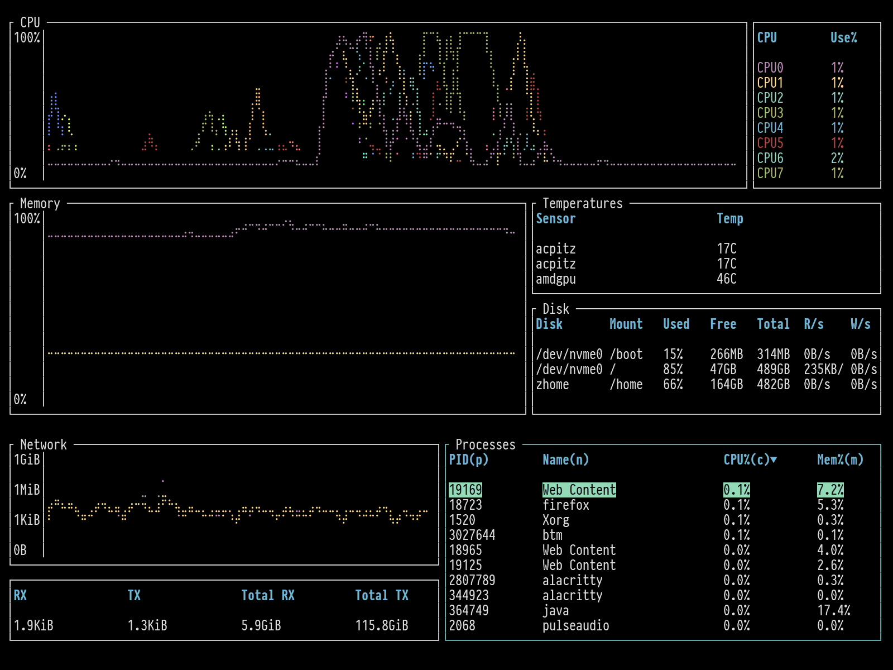
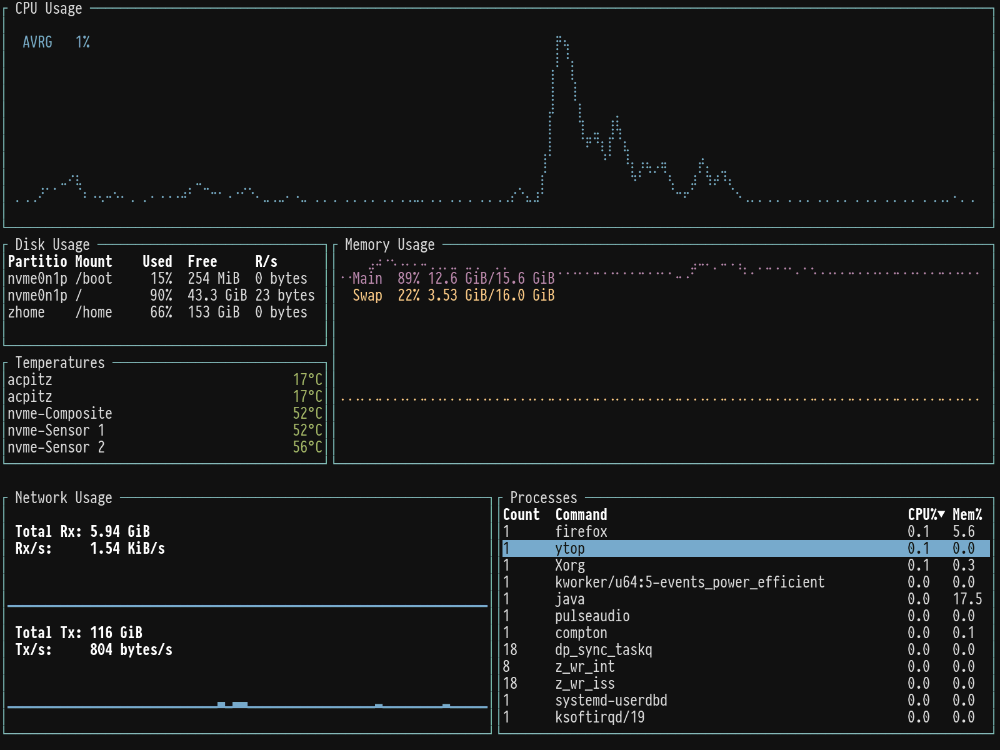
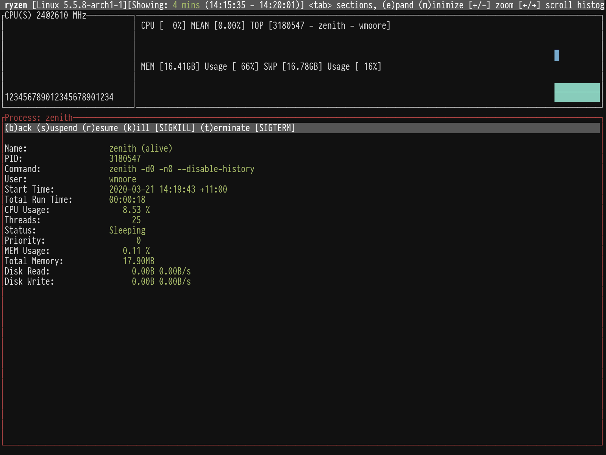
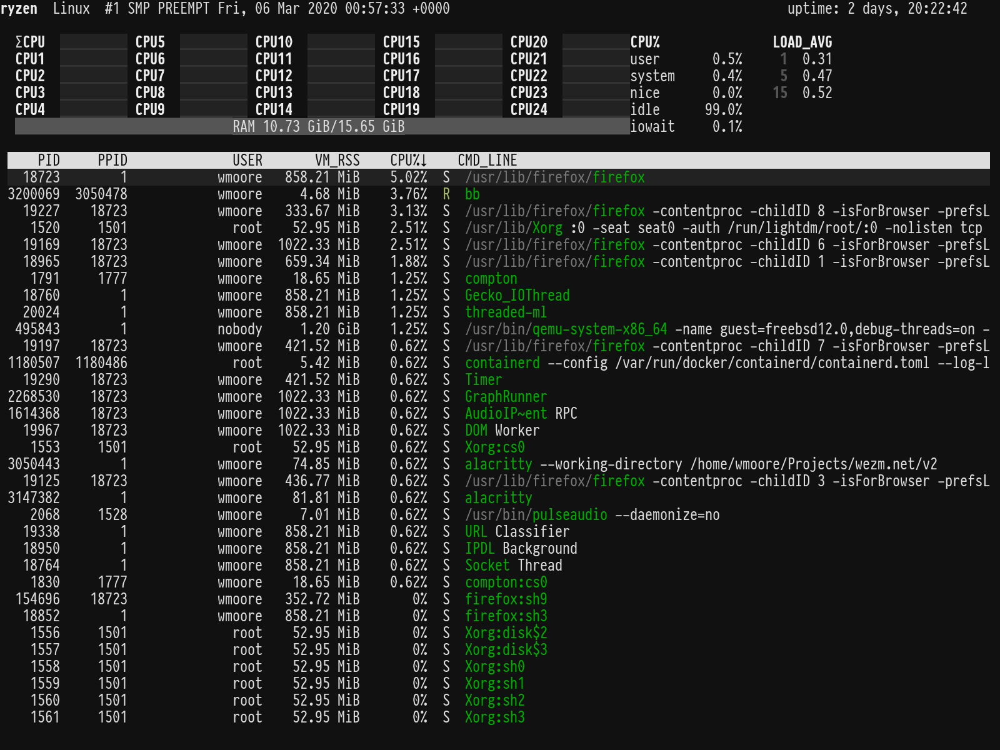

+++
title = "Comparing Alternatives to top Written in Rust"
date = 2020-03-21T10:45:00+11:00

[extra]
updated = 2020-03-22T12:52:23+11:00
+++

Recently I aliased `top` to [ytop]. Then I became aware of [bottom], and
[zenith]. These are all terminal based system monitoring tools that you might
use instead of `top`. In this post I set out to compare them.

{{ figure(image="posts/2020/rust-top-alternatives/ytop-btm-zenith-screenshot.png", link="ytop-btm-zenith-screenshot.png", width=1600, quality=60, alt="Screenshot of ytop, bottom, and zenith while building some Rust code", caption="Left to right: ytop, bottom, and zenith.") }}

<!-- more -->


The Rust programming language helps people write efficient, reliable software.
I like the language and the tools people are
building with it.

If you're interested in more Rust CLI tools check out my
post: [An Illustrated Guide to Some Useful Command Line
Tools](https://www.wezm.net/technical/2019/10/useful-command-line-tools/).


As the title states all three tools are written in Rust. They show similar
information and are all open source under the MIT license. I tested each one
on: Arch Linux, FreeBSD 12.1, macOS Mojave, and Windows 10. At the time of
testing, all three failed to build on FreeBSD and Windows. Figures below are
from the Arch Linux system, which is a [12 core AMD Ryzen desktop PC][ryzen-pc].

`ytop` and `bottom` use a layout that appears to be inspired by [gotop]. In
fact, `ytop` is written by the same person as `gotop`. `zenith` uses a layout
that's a bit more like traditional `top` with histograms above the process
list.

I typically use `top` to:

* Check on overall system load and free memory.
* Find specific processes that are using a lot of CPU or memory.
* Observe CPU and memory use over time.
* Occasionally kill processes.

I find the `zenith` layout more information dense, with less space taken up
with graphs. I also like the header row with info and help. The main feature
that it is missing compared to the others is temperatures — but that's in the
list of planned features. There is one issue with `zenith`: it doesn't show my
ZFS pool. My system has an NVMe system disk and a ZFS pool of 3 SSDs that is
mounted as `/home`, which is absent in the disk summary. I've raised [an issue
on GitHub][zenith-zfs].

The individual lines for each CPU in `bottom` makes the display quite noisy. I
prefer the aggregated line that `ytop` shows. `ytop` has a handy `-m` option
to only show CPU, memory, and process list.

So, after reviewing them all I'm going to start using `zenith`. It might not
be quite as pretty in screenshots but it's the best for doing this things
I want to do with a `top` like tool.

Read on for further information about each tool, including an additional
honorable mention, [bb].

### bottom

[Repository][bottom]

**Version tested:** 0.2.2  
**Runtime dependencies:** None  
**Lines of code:** 4894  
**Cargo dependencies:** 109  
**Stripped binary size:** 3.4MiB  

`bottom` has `vi` style key bindings for navigating the process list. The
selection is not stable across updates but there is a key binding, `f` to
freeze the display that allows you navigate the list without it changing. It
supports killing processes with `dd` but does not prompt for the signal to
send. It shows a confirmation before killing the process.

**Usage:**

    bottom 0.2.2
    Clement Tsang <cjhtsang@uwaterloo.ca>
    A cross-platform graphical process/system monitor with a customizable interface and a multitude of features. Supports
    Linux, macOS, and Windows.

    USAGE:
        btm [FLAGS] [OPTIONS]

    FLAGS:
        -a, --avg_cpu                Enables showing the average CPU usage.
        -S, --case_sensitive         Match case when searching by default.
        -c, --celsius                Sets the temperature type to Celsius.  This is the default option.
            --cpu_default            Selects the CPU widget to be selected by default.
            --disk_default           Selects the disk widget to be selected by default.
        -m, --dot_marker             Use a dot marker instead of the default braille marker.
        -f, --fahrenheit             Sets the temperature type to Fahrenheit.
        -g, --group                  Groups processes with the same name together on launch.
        -k, --kelvin                 Sets the temperature type to Kelvin.
        -l, --left_legend            Puts external chart legends on the left side rather than the default right side.
            --memory_default         Selects the memory widget to be selected by default.
            --network_default        Selects the network widget to be selected by default.
            --process_default        Selects the process widget to be selected by default.  This is the default if nothing
                                     is set.
        -R, --regex                  Use regex in searching by default.
        -s, --show_disabled_data     Show disabled data entries.
            --temperature_default    Selects the temp widget to be selected by default.
        -u, --current_usage          Within Linux, sets a process' CPU usage to be based on the total current CPU usage,
                                     rather than assuming 100% usage.
        -W, --whole_word             Match whole word when searching by default.
        -h, --help                   Prints help information
        -V, --version                Prints version information

    OPTIONS:
        -C, --config <CONFIG_LOCATION>    Sets the location of the config file.  Expects a config file in the TOML format.
        -r, --rate <RATE_MILLIS>          Sets a refresh rate in milliseconds; the minimum is 250ms, defaults to 1000ms.
                                          Smaller values may take more resources.

### ytop

[Repository][ytop]

**Version tested:** 0.5.1  
**Runtime dependencies:** None  
**Lines of code:** 1903  
**Cargo dependencies:** 89  
**Stripped binary size:** 2.1MiB  

`ytop` has `vi` style key bindings for navigating the process list. The
selection remains on the same process across updates. It supports killing
processes with `dd` but does not prompt for the signal to send. There is
no confirmation when typing `dd`.

**Usage:**

    ytop 0.5.1

    USAGE:
        ytop [FLAGS] [OPTIONS]

    FLAGS:
        -a, --average-cpu    Show average CPU in the CPU widget
        -b, --battery        Show Battery widget (overridden by 'minimal' flag)
        -f, --fahrenheit     Show temperatures in fahrenheit
        -h, --help           Prints help information
        -m, --minimal        Only show the CPU, Mem, and Process widgets
        -p, --per-cpu        Show each CPU in the CPU widget
        -s, --statusbar      Show a statusbar with the time
        -V, --version        Prints version information

    OPTIONS:
        -c, --colorscheme <colorscheme>    Set a colorscheme [default: default]
        -i, --interface <interface>        The name of the network interface to show in the Net widget. 'all' shows all
                                           interfaces [default: all]
        -I, --interval <interval>          Interval in seconds between updates of the CPU and Mem widgets. Can specify
                                           either a whole number or a fraction with a numerator of 1 [default: 1]

### zenith

[Repository][zenith]

**Version tested:** 0.7.5  
**Runtime dependencies:** None  
**Lines of code:** 2006  
**Cargo dependencies:** 105  
**Stripped binary size:** 2.6MiB  

`zenith` has a small number of key bindings for changing the panes. You can
navigate the process list with the arrow keys. The selection is not stable
across updates but the default update frequency is 2 seconds. Pressing Enter on
process shows expanded information about it and allows you to send it various
signals:

**Usage:**

    zenith 0.7.5
    Benjamin Vaisvil <ben@neuon.com>
    Zenith, sort of like top but with histograms.
    Up/down arrow keys move around the process table. Return (enter) will focus on a process.
    Tab switches the active section. Active sections can be expanded (e) and minimized (m).
    Using this you can create the layout you want.

    USAGE:
        zenith [FLAGS] [OPTIONS]

    FLAGS:
            --disable-history    Disables history when flag is present
        -h, --help               Prints help information
        -V, --version            Prints version information

    OPTIONS:
        -c, --cpu-height <INT>        Height of CPU/Memory visualization. [default: 10]
            --db <STRING>             Database to use, if any. [default: /home/wmoore/.zenith]
        -d, --disk-height <INT>       Height of Disk visualization. [default: 10]
        -n, --net-height <INT>        Height of Network visualization. [default: 10]
        -p, --process-height <INT>    Min Height of Process Table. [default: 8]
        -r, --refresh-rate <INT>      Refresh rate in milliseconds. [default: 2000]

### bb

[Repository][bb]

**Version tested:** git 35c3017  
**Runtime dependencies:** None  
**Lines of code:** 8450  
**Cargo dependencies:** 27  
**Stripped binary size:** 534KiB  

`bb` is closer to regular `top` than the other tools. It shows a CPU histograms
and a process list.  It has the best process view though, allowing sending all
named signals, filtering the list by name or pid, toggleable tree view and
following a process group. It also has the fewest crate dependencies and
smallest binary. The drawback is the author describes it as, "a "weekend"
side-project made for fun", and it hasn't seen any updates since Nov 2019.

**Usage:**

`bb` does not have any command line arguments.

### Test Notes

The dependency count was calculated using [cargo-tree] as follows:

    cargo tree --no-dev-dependencies --no-indent -q | sed 's/ (\*)$//' | sort -u | wc -l

The lines of code values were calculated using [tokei]. The value of the Code
column in the Total row from the output of `tokei src` was used. E.g. 2372 in
the output below:

    -------------------------------------------------------------------------------
     Language            Files        Lines         Code     Comments       Blanks
    -------------------------------------------------------------------------------
     JSON                    5          105          105            0            0
     Markdown                2          231          231            0            0
     Rust                   18         2404         2001           87          316
     TOML                    2           39           35            2            2
    -------------------------------------------------------------------------------
     Total                  27         2779         2372           89          318
    -------------------------------------------------------------------------------

[ytop]: https://github.com/cjbassi/ytop
[bottom]: https://github.com/ClementTsang/bottom
[zenith]: https://github.com/bvaisvil/zenith
[gotop]: https://github.com/cjbassi/gotop
[zenith-zfs]: https://github.com/bvaisvil/zenith/issues/9
[ryzen-pc]: https://bitcannon.net/page/ryzen9-pc/
[cargo-tree]: https://github.com/sfackler/cargo-tree
[tokei]: https://github.com/XAMPPRocky/tokei
[bb]: https://github.com/epilys/bb
