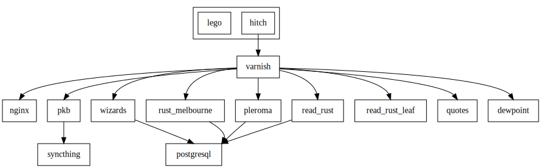

+++
title = "Alpine Linux and Docker Infrastructure Three Years Later"
date = 2022-02-28T09:52:10+10:00

[extra]
#updated = 2022-01-27T21:07:32+10:00
+++

Three years ago I published,
[Rebuilding My Personal Infrastructure With Alpine Linux and Docker][original-post],
in which I described how I was hosting various applications using an [Alpine
Linux][alpine] host and [Docker] on a virtual machine at [Vultr]. I thought it
would be good to write a follow-up on how this worked out.

<!-- more -->

The server I set up in 2019 is still running, although it has been through a
few Alpine upgrades in that time. Since there are very few packages installed
on the host, upgrades are painless. When I originally configured the
server Docker Compose was not in the stable Alpine package repos. It was added
in the mid-2019 Alpine 3.10 release. I was glad to be able to remove `pip` and
not have to manually manage compose updates after migrating to the package from
that point on.

In 2019 the services I was hosting looked like this:

In 2022 the situation is now:

As you can see the server is now running more containers. It now hosts a number
of new services including a [Pleroma] instance and several web-applications I
built in Rust ([leaf], [quotes], [dewpoint]). I also retired the [Binary
Trance] Rails instance and migrated from [acme.sh] to [lego]. I ran a [Nitter]
instance for a while but removed it after it bots made it consume a huge amount
of bandwidth. See my [Burning 2.5Tb of Bandwidth Hosting a Nitter
Instance](@/posts/2021/nitter-bandwidth/index.md) post for more details on
that.

The [Read Rust] application is implemented in [Crystal]. This one posed a bit
of a challenge. It is the only container I run that is not derived from a
minimal Alpine base image that I build myself. Instead, it uses `debian-slim`. I
need to use a specific version of the Crystal compiler to build my application,
which means I can't use the version in the Alpine package repos. Additionally
the Linux binaries that the project published for this version are not
dynamically linked but the bundled `libgc.a` assumes a `glibc` based system:

    $ crystal build src/asdf.cr
    /usr/lib/gcc/x86_64-alpine-linux-musl/10.3.1/../../../../x86_64-alpine-linux-musl/bin/ld: /crystal-0.34.0-1/bin/../lib/crystal/lib/libgc.a(pthread_support.o): in function `GC_thr_init':
    pthread_support.c:(.text+0x1137): undefined reference to `gnu_get_libc_version'
    ⋮

For this reason I opted to use a Debian base image for this container and that's
worked fine.

Another notable change is the move from [acme.sh] to [lego] for managing TLS
certificates. In my original post I noted the following regarding how the
certificates were renewed:

> Docker and cron is also a challenge. I ended up solving that with a simple
> solution: use the host cron to `docker exec` acme.sh in the `hitch` container.
> Perhaps not “pure” Docker but a lot simpler than some of the options I saw.

It turned out that this never worked. I could see that cron was running the
script but the certs would not get renewed. For a while I ran the
script manually to renew them, which did work. Eventually I got sick of this, and
thinking `acme.sh` was to blame I searched for an alternative.

I settled on [lego], an ACME client implemented in Go. I [discovered and
suggested a fix for a bug][lego-bug] and [contributed LuaDNS
support][lego-luadns] in May 2020 and then migrated over to using it instead of
`acme.sh`. It was in the final stages of test this that I discovered the cron
bug was in my script all along. Adding `-T` to inhibit `docker-compose exec`
from allocating a TTY fixed the issue. It's likely this would have fixed the
issue for `acme.sh` as well. Ultimately lego felt like the better option as the
code in `acme.sh` for constructing API requests and [parsing their
results][acme-parse] seemed quite fragile

[Jokes aside][it-works-on-my-machine], I still find the Docker workflow of
iterating on an image locally then shipping it when it's working to be quite
pleasant. In summary this server has served me well over the last three years
and I have no immediate plans to rebuild again. It's been reliable and mostly
hassle free. Hosting on [Vultr] has also been reliable and stable over that
whole time with only the odd interruption for network maintenance or network
issues.

[original-post]: https://www.wezm.net/technical/2019/02/alpine-linux-docker-infrastructure/
[alpine]: https://alpinelinux.org/
[Docker]: https://www.docker.com/
[Vultr]: https://www.vultr.com/?ref=7903263
[lego-luadns]: https://github.com/go-acme/lego/pull/1135
[lego-bug]: https://github.com/go-acme/lego/issues/1150
[acme-parse]: https://github.com/acmesh-official/acme.sh/blob/2a2d556551e9266a3924da205c1ede55d89a689d/dnsapi/dns_lua.sh#L117-L126
[Pleroma]: https://pleroma.social/
[lego]: https://go-acme.github.io/lego/
[acme.sh]: https://github.com/acmesh-official/acme.sh
[Read Rust]: https://github.com/wezm/read-rust/
[Crystal]: https://crystal-lang.org/
[Binary Trance]: https://binarytrance.com/
[leaf]: https://github.com/wezm/leaf
[quotes]: https://github.com/wezm/Quotes
[dewpoint]: https://github.com/wezm/dewpoint.7bit.org
[Nitter]: https://github.com/zedeus/nitter
[it-works-on-my-machine]: https://www.reddit.com/r/ProgrammerHumor/comments/cw58z7/it_works_on_my_machine/
